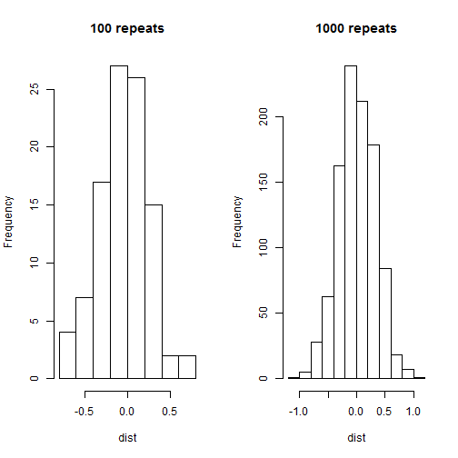
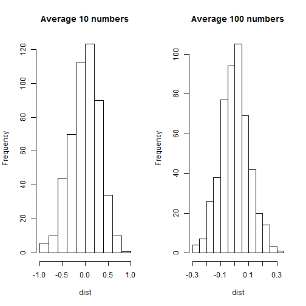
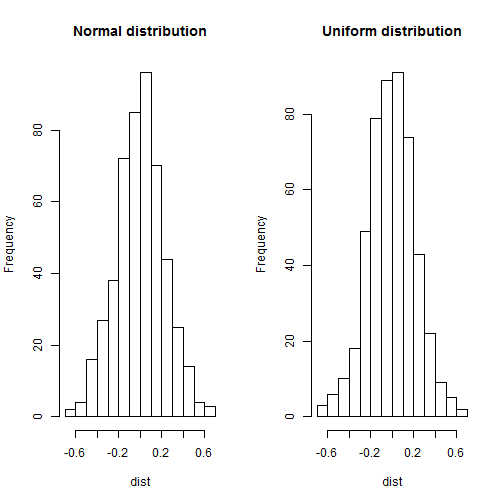

## Central Limit Theorem
A statistical theory that states that given a sufficiently large sample size from a population with a finite level of variance, the mean of all samples from the same population will be approximately equal to the mean of the population.

---

## Large number of trials lead to smoother distribution

 

---

## Take an average of bigger number of samples makes distribution narrower
 

---

## Sample distribution other than normal distribution has same result

 

